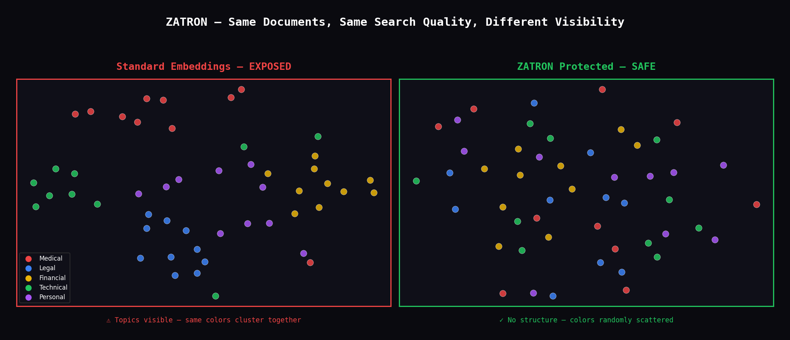
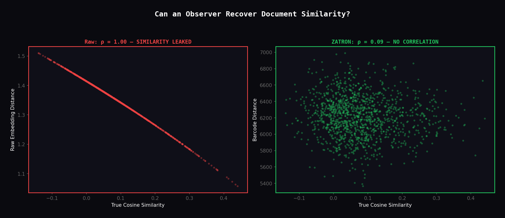

# ZATRON

**Zero-Access Transformed Retrieval Over Noise**

Privacy-preserving semantic search via multi-channel modular arithmetic. Search sensitive documents by meaning without exposing content — not to the database, not to the server, not even to the key holder.

**Patent Pending** · US Provisional Patent Filed 2026
**[▶ Live Demo](https://huggingface.co/spaces/zahraarman/ZATRON)** · **[GitHub](https://github.com/zahraarmantech/ZATRON)** · Patent Pending · US Provisional Patent Filed 2026
---

## The Problem

Standard semantic search stores embeddings as plain vectors. Anyone with database access can cluster documents by topic and infer content — without reading a single word.

## The Solution

ZATRON transforms embeddings into modular barcodes. Search still works. Structure disappears.



**Left:** raw embeddings — same-topic documents cluster together. An attacker sees your data structure.

**Right:** ZATRON protected — random scatter. No topic structure visible.

---

## Attack Analysis

Can an observer recover document similarity from ZATRON barcodes?



**Left:** raw embedding distances perfectly correlate with true similarity (ρ = 1.00). Attacker wins.

**Right:** ZATRON barcode distances show zero correlation (ρ = 0.09). Attacker gets nothing.

---

## Results

All numbers verified on real data. No synthetic benchmarks.

| Benchmark | Corpus | Quality (% of cosine) |
|-----------|--------|-----------------------|
| MSMARCO | 626,906 passages | 98.2% |
| SciFact | 5,183 docs | 95.7% |
| NFCorpus | 3,633 docs | 89.9% |
| STS-B | 1,379 pairs | 100.1% |

| Comparison | MRR@10 | Encrypted |
|------------|--------|-----------|
| Cosine (float32) | .530 | No |
| Binary quantization | .514 | No |
| Product quantization | .520 | No |
| **ZATRON (ours)** | **.528** | **Yes** |

**8× faster** than CKKS FHE on identical hardware (5ms vs 39ms per comparison).

Three embedding models tested. Five languages verified. Eight security tests passed.

## Try It

```bash
pip install sentence-transformers scikit-learn matplotlib
python demo.py
```

This runs on 50 real documents, shows search quality preserved and security verified, and generates the visualizations above.

## Quick Start

```python
from zatron_search import ModularBarcodeSystem

system = ModularBarcodeSystem(key="your-secret-key", n_channels=200)
system.fit(corpus_embeddings)

barcodes = system.encode(corpus_embeddings, doc_ids)
query_bc = system.encode_query(query_embedding)
distance = system.compare(query_bc, barcodes[0])
```

## How It Works

1. **Decompose**: Project embedding onto 200 PCA channels
2. **Quantize**: Convert each channel to integer (0–49)
3. **Mask**: Apply rejection-sampled salt + wave interference per document
4. **Store**: Keep only modular residues (mod prime)
5. **Search**: Compare in modular space — raw embedding never reconstructed

## Security

Eight independent attack vectors tested:

| Attack | Result | Status |
|--------|--------|--------|
| IND-CPA indistinguishability | p = 0.48 | Pass |
| Statistical correlation | ρ = 0.10 | Pass |
| Entropy analysis | 100% | Pass |
| Per-channel leakage | \|r\| = 0.30 | Pass |
| Key recovery | 1.0% vs 1.9% baseline | Pass |
| Chosen-plaintext | ρ = 0.00 | Pass |
| Timing side-channel | p = 1.00 | Pass |
| CRT reconstruction | \|r\| = 0.01 | Pass |

**Threat model**: Protected against unauthorized database observers. The key holder computes distances but never reconstructs raw embeddings. This is a randomized privacy-preserving encoding, distinct from reversible block cipher encryption.

Formal proofs under PRF assumption (HMAC-SHA256) in `paper/Formal_Security_Proof.pdf`.

## Project Structure

```
ZATRON/
├── README.md
├── zatron_search.py              # Core system (self-testing)
├── demo.py                       # One-command demo
├── generate_visuals.py           # Generate comparison images
├── zatron_comparison.png         # t-SNE visualization
├── zatron_attack.png             # Attack analysis visualization
├── demo/
│   └── encrypted_search_demo.jsx # Interactive web demo
├── paper/
│   ├── Lightweight_Encrypted_Semantic_Search.pdf
│   └── Formal_Security_Proof.pdf
└── LICENSE
```

## Cite

```
@misc{arman2026zatron,
  title={Lightweight Encrypted Semantic Search via Multi-Channel Modular Signaling},
  author={Zahra Arman},
  year={2026},
  note={US Provisional Patent Filed. github.com/zahraarmantech/ZATRON}
}
```

## License

MIT License. The method is covered by a pending US provisional patent.

## Author

**Zahra Arman** — Independent Researcher, Plano, TX — zahra.arman.tech@gmail.com
